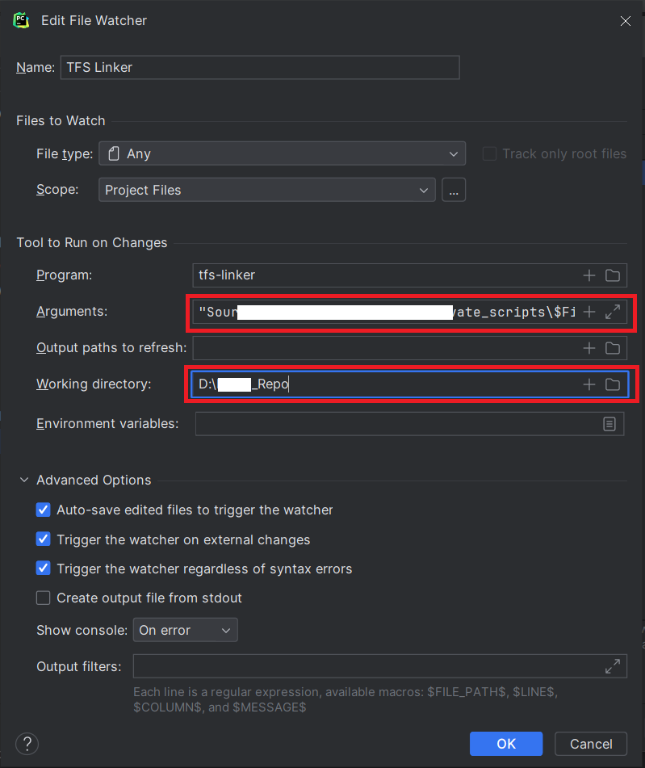

# TFS Linker

### Auto Setup for IntelliJ Based IDE:

To set up TFS Linker in your IntelliJ-based IDE, follow these steps:

1. Run `./tfs-linker-auto-config` in your terminal from the IDE's project path to initiate the configuration process.

    

### Manual setup for File Watcher:

Follow these steps to configure File Watcher:

1. Open your IDE and go to Settings.
2. Look for the File Watchers section in Tools.
3. Create a new File Watcher with the following settings:
   - **Name:** TFS Linker
   - **File Type:** Any
   - **Program:** tfs-linker
   - **Working directory:** Starting TFS Workspace directory that has to be mapped
   - **Arguments:** "{{RelativePathOfDirectoryOpenedInIDEFromTFSWorkspaceDirectory}}\$FilePathRelativeToProjectRoot$" "{{TFSExecutablePath}}"
   - **Output Paths & Environment Variables:** Leave empty.
   
    
    

4. Apply the changes and close the settings.

Now, your File Watcher is set up to work with TFS Linker in your Intellij-based IDE.